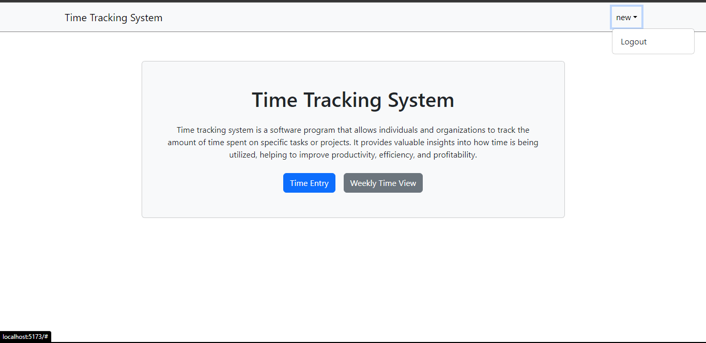

# Time Tracking System Client Side



## About

Time tracking system is a software program that allows individuals and organizations to track the amount of time spent on specific tasks or projects. It provides valuable insights into how time is being utilized, helping to improve productivity, efficiency, and profitability.

## Getting Started

To get started with this project, follow the steps below:

### Prerequisites

Make sure you have [Node.js](https://nodejs.org/) installed on your machine.

### Installation

1. Clone the repository:

   ```bash
   git clone https://github.com/TajwarSaiyeed/time-tracking-system-client.git
   ```

2. Navigate to the project directory:

   ```bash
   cd time-tracking-system-client
   ```

3. Install the dependencies:

   ```bash
   npm install
   ```

### Development

To start the development server, run the following command:

```bash
npm run dev
```
